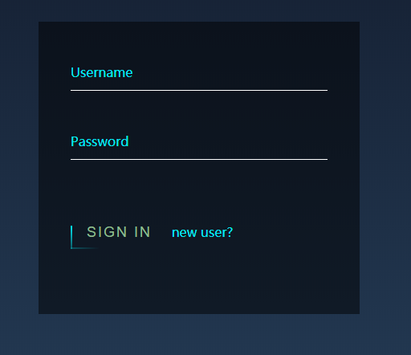
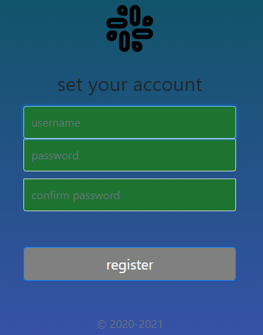
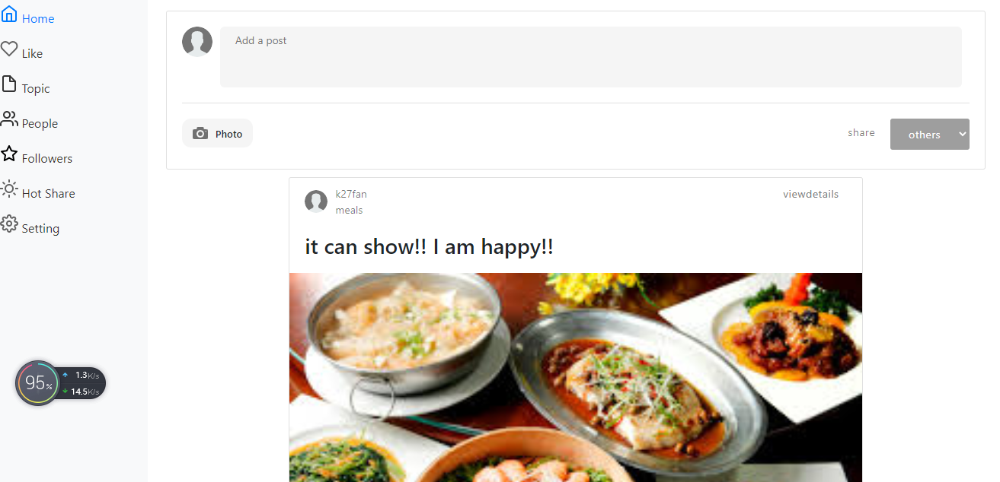
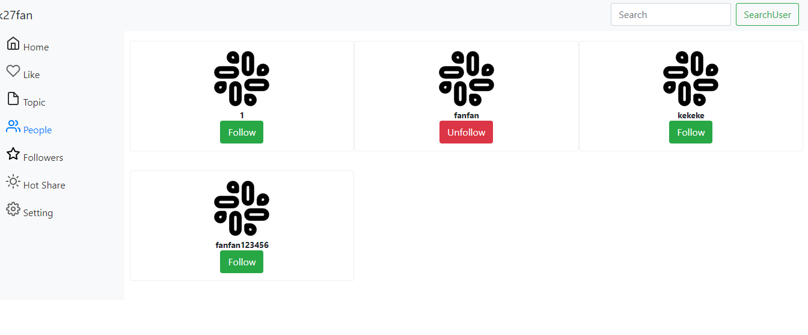
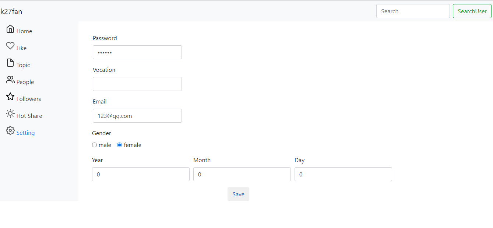

# Social network
This is a simple social network for users to share life and explore interesting topic
## content
### login page

### register page

 ### home page
 
 ### like and comments
 
 ### follow some user to track their posts

### set your setting


## Tools & Devleopment environment
- Jdk 1.11
- Maven 3.2
- Spring Boot 2.0
- ThymeLeaf 4.0
- Mybaits + Mysql8.0 +JDBC

## Get Started

- set your database configuration in application.properties file,you can also use our sql database
```javascript
spring.datasource.druid.url= jdbc:mysql://localhost:3306/${database name}?useUnicode=true&characterEncoding=UTF-8&userSSL=false&serverTimezone=GMT%2B8
spring.datasource.druid.username= root
spring.datasource.druid.password= ${your password}
spring.datasource.druid.driver-class-name=com.mysql.cj.jdbc.Driver

```
- mvn springboot: run (open the project by IDEA and run Application.java file) 
- go to <http://localhost:8080> 
## Demo
go to <https://explore-your-life-new-heroku.herokuapp.com/?l=en_US9>
## issue
 after delpoy on heroku, it can not support to post image as we do not have store service

